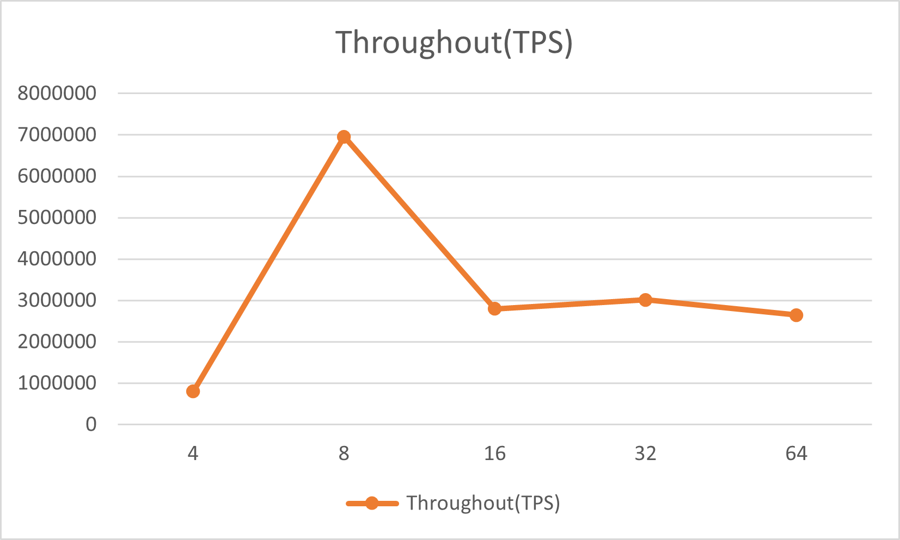
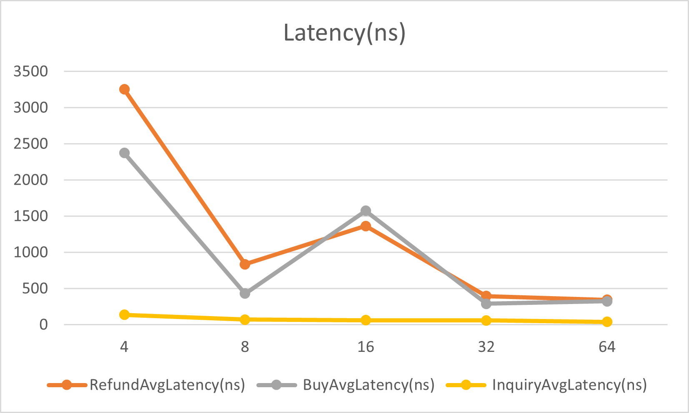
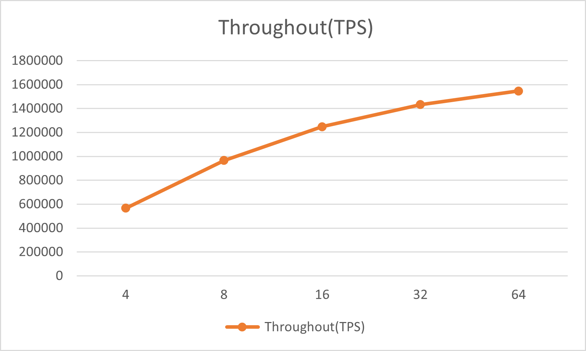
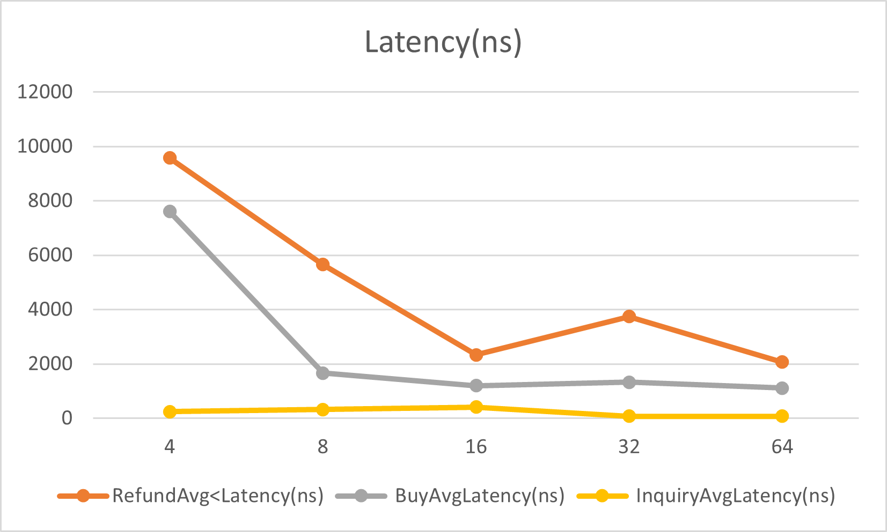

# 大作业报告: 用于列车售票的可线性化并发数据结构

陆展 202228013229074

---

> 目录
> [toc]

---

<div STYLE="page-break-after: always;"></div>

## 设计思路

除了初始myproject目录中已经预先定义的文件, 本系统的主要实现集中在 `Seat.java`, `TicketingDS.java`和 `Test.java`.

针对售票系统的查票, 买票和退票等操作, 同步机制的范围可以细化到具体的列车座位上, 以此来降低线程间的竞争.

以下是本系统的一些基本假设, 后续设计与实现均遵循:

- 忽略第0位, 从第1位用起, 本项目中所有初始下标都从1开始.
- 车站区间为形如 `[departure, arrival)`的左闭右开形式.

### Seat.java

`Seat`表示具体列车座位上发售情况, 并包含对该座位的查票, 买票和退票操作.

```java
public class Seat {
    private AtomicLong reservedStation;
}
```

`Seat`中只有一个 `AtomicLong`类型的成员变量 `reservedStation`. 由于老师提到用于测试的**stationnum**最大为30, 因此可以用31位二进制数组来表示该座位上各个站点的售票情况, 从低往高, 第 `i`位为 `1`表示该座位在第 `i`个站的票已售出, 为 `0`则表示尚未售出. 在**Java**里没有只表示 `01`的 `bit`类型, 可以用 `long`来进行代替, 结合位运算可以实现高效的查票, 买票,和退票操作, 后文会详细介绍. 又因为要保证多线程之间的同步, 最终实现时采用原子类型 `AtomicLong`进行存储.

#### 查询操作

```java
public boolean available(int departure, int arrival) {
    long section = (1 << arrival) - (1 << departure);
    return (reservedStation.get() & section) == 0;
}
```

`available`方法查询该座位在区间 `[departure, arrival)`上是否还可购买.

`section`通过位运算得到区间对应的二进制形式, 如 `departure=2`, `arrival=4`, 那么 `section = 10000 - 100 = 01100`. `reservedStation.get() & section`就可以计算出区间 `[2,4)`, 即第2,3站的售票情况了, 结果为0说明这些站点的票均有票, 可以在该区间上进行购买.

#### 买票操作

```java
public Result buy(int departure, int arrival) {
    long section = (1 << arrival) - (1 << departure);
    int i = 0;
    while (true) {
        long oldValue = reservedStation.get();
        // seat available, try CAS opereation
        if ((oldValue & section) == 0) {
            long newValue = oldValue | section;
            if (reservedStation.compareAndSet(oldValue, newValue)) {
                return new Result(true, oldValue, newValue);
            } else {
                i++;
                if (i >= 5) {
                    i = 0;
                    try {
                        Thread.sleep(1);
                    } catch (InterruptedException e) {
                    }
                }
            }
        } else { // not available
            return new Result();
        }
    }
}
```

买票之前必要先进行查询操作. 对 `section`的计算和对是否有票的操作与上文相同.
发现车票可买后, 计算出买票后 `reservedStation`的新值, 执行**CAS**操作, 成功则返回结果, 失败则重试, 直到该区间的车票被其他线程抢先购买, 不符合售出条件则返回买票失败的结果. 当**CAS**操作连续失败多次后, 进行回退操作, 让线程 `sleep`一段时间.

#### 退票操作

```java
public Result refund(int departure, int arrival) {
    long section = (1 << arrival) - (1 << departure);
    int i = 0;
    while (true) {
        long oldValue = reservedStation.get();
        // refund legal
        if ((oldValue & section) == section) {
            long newValue = oldValue & (~section);
            if (reservedStation.compareAndSet(oldValue, newValue)) {
                // System.err.println("[Debug]:refund op cas failed "+ i+" times");
                return new Result(true, oldValue, newValue);
            } else {
                i++;
                if (i >= 5) {
                    i = 0;
                    try {
                        Thread.sleep(1);
                    } catch (InterruptedException e) {
                    }
                }
            }
        } else { // not available
            return new Result();
        }
    }
}
```

退票操作和买票操作流程相同, 但是在车票是否可退和计算退款后 `reservedStation`的新值时的位运算操作有所区别.

### TicketingDS.java

#### 查票操作及优化

```java
public int inquiry(int route, int departure, int arrival) {
    if (!verify(route, departure, arrival)) {
        return 0;
    }

    int ans = 0;
    for (int coachIndex = 1; coachIndex <= coachNum; ++coachIndex) {
        for (int seatIndex = 1; seatIndex <= seatNum; ++seatIndex) {
            Seat s = seats[route][coachIndex][seatIndex];
            if (s.available(departure, arrival)) {
                ++ans;
            }
        }
    }
    return ans;
}
```

基础的查票操作如上所示, `verify`是对数据合法性的验证, 然后每次查询都遍历所有 `Seat`, 查询该座位是否可购买并统计总数. 但是由于查票操作占比达到60%, 并且 `coachnum`, `seatnum`越大, 需要遍历的 `Seat`会越多,复杂度为$O(coachnum*seatnum)$, 如果这期间没有影响结果的买票和退票操作, 每次查票都反复遍历浪费了很多时间.

优化的思路就是维护对应 `route`, `departure`, `arrival`的剩余车票数, 这样每次查票时只需要一次对数组的随机访问即可, 复杂度为$O(1)$, 但代价就是需要额外的数据结构存储余票, 并且在买票和退票时因为产生余票数变动需要额外的维护开销. 但是由于查票操作的开销占比较高, 优化后系统整体性能还是所有提高的. 优化后的实现如下所示.

```java
private LongAdder[][][] inquiryCache;

public int inquiry(int route, int departure, int arrival) {
    if (!verify(route, departure, arrival)) {
        return 0;
    }

    return inquiryCache[route][departure][arrival].intValue();
}
```

因为高并发下 `AtomicLong`经常**CAS**失败导致效率降低, JDK1.8新增一个原子性操作类 `LongAdder`，用于代替 `AtomicLong`的功能, 在高并发下实现高性能统计. 而在本场景中, 买票和退票对余票只有 `-1`和 `+1`的修改, 非常适合用 `LongAddr`作为计数器. 初始化时将 `inquiryCache`中每个元素的值置为总车票数.

#### 买票操作

```java
public Ticket buyTicket(String passenger, int route, int departure, int arrival) {
    if (!verify(route, departure, arrival)) {
        return null;
    }

    if (inquiryCache[route][departure][arrival].intValue() == 0) {
        return null;
    }

    Ticket ticket = null;
    int begin = seatBegin.nextInt(seatSize);
    int index;
    int coachIndex;
    int seatIndex;
    for (int i = 0; i < seatSize; ++i) {
        index = (begin + i) % seatSize;
        coachIndex = index / seatNum + 1;
        seatIndex = index % seatNum + 1;
        Seat s = seats[route][coachIndex][seatIndex];
        Result result = s.buy(departure, arrival);
        if (result.success) {
            ticket = new Ticket();
            ticket.tid = nextTicketID.getAndIncrement();
            ticket.passenger = passenger;
            ticket.route = route;
            ticket.coach = coachIndex;
            ticket.seat = seatIndex;
            ticket.departure = departure;
            ticket.arrival = arrival;
            reservedTicketMap.put(ticket.tid, ticket);
            inquiryCacheDecrement(result.oldValue, result.newValue, route, departure,
            arrival);
            return ticket;
        }
    }
    return null;
}
```

买票前, 首先利用 `inquiryCache`查询余票数量, 数量为 `0`说明无票可买.

遍历座位查询是否可以买票时, 曾经考虑过一种优化策略: 即通过设置随机的遍历起始点, 防止所有线程都以相同的顺序遍历座位, 以此减少争用. 但是在实际测试中, 由于本身有一定波动, 加上线程执行有快有慢, 这种打乱带来的提升并不显著. 而且这种随机遍历顺序会导致 `replay.sh`试图重现**history**时失败. 遂弃用.

成功买到票后, 用 `reservedTicketMap`按照 `tid`存储车票. 这是用线程安全的 `HashMap`, 即 `ConcurrentHashMap`实现的, 后续在退票时进行对车票进行合法性验证. 然后调用 `inquiryCacheDecrement`维护余票数量, 其实现如下. 枚举所有可能受影响的区间, 如果原本可购买的区间因为本次购票操作而变为不可购买, 则将对应的余票 `-1`.

```java
private void inquiryCacheDecrement(long oldValue, long newValue, int route, int departure, int arrival) {
    long section;
    // update the sections that will be influenced
    for (int i = 1; i <= arrival - 1; ++i) {
        for (int j = i + 1; j <= stationNum; ++j) {
            section = (1 << j) - (1 << i);
            // available before buying
            // unavailable after buying
            if (((section & oldValue) == 0) &&
                    ((section & newValue) != 0)) {
                inquiryCache[route][i][j].decrement();
            }
        }
    }
}
```

#### 退票操作

```java
public boolean refundTicket(Ticket ticket) {
    Ticket real = reservedTicketMap.get(ticket.tid);
    if (real != null) {
        if ((real.tid == ticket.tid) && (real.passenger.equals(ticket.passenger)) &&
                (real.route == ticket.route) && (real.coach == ticket.coach)
                && (real.seat == ticket.seat) && (real.departure == ticket.departure)
                && (real.arrival == ticket.arrival)) {
            // printTicket(ticket);
            Seat s = seats[ticket.route][ticket.coach][ticket.seat];
            Result result = s.refund(ticket.departure, ticket.arrival);
            if (result.success) {
                reservedTicketMap.remove(ticket.tid);
                inquiryCacheIncrement(result.oldValue, result.newValue, ticket.route, ticket.departure,
                        ticket.arrival);
            }
            return result.success;
        }
    }
    return false;
}
```

退票时, 先检验合法性, 用 `reservedTicketMap`判断是否为已售出的票, 然后判断各项属性的是否与真实售出的票相等. 对于合法的退票操作, 根据车票信息在对应的 `Seat`调用 `refund`完成修改, 最后将票从 `reservedTicketMap`移除, 并调用 `inquiryCacheIncrement`完成余票的更新, 其实现如下所示, 与 `inquiryCacheDecrement`类似.

```java
private void inquiryCacheIncrement(long oldValue, long newValue, int route, int departure, int arrival) {
    long section;
    // update the sections that will be influenced
    for (int i = 1; i <= arrival - 1; ++i) {
        for (int j = i + 1; j <= stationNum; ++j) {
            section = (1 << j) - (1 << i);
            // unavailable before refunding
            // available after refunding
            if (((section & oldValue) != 0) &&
                    ((section & newValue) == 0)) {
                inquiryCache[route][i][j].increment();
            }
        }
    }
}
```

### Test.java

`Test.java`用于测试并发数据结构的性能. 分为以下三个阶段

1. `initTestCase`. 初始化 `TicketingDS`, 创建测试线程.
2. `test`. 并发执行测试线程. 测试线程会按照预先设定的比例执行查票, 买票和退票操作. 具体实现和 `GenerateHistory.java`类似, 根据操作类型调用相应的方法, 并记录耗时.
3. `analyze`. 统计时间并计算延迟和吞吐量, 将结果写入 `result.csv`文件

<div STYLE="page-break-after: always;"></div>

## 正确性分析

### 理论分析

#### 进展性分析

由于所有方法都没有使用锁机制, 因此**DeadLock-free**和**Starvation-free**这两种**lock-based**的进展性无从谈起, 在下方的表格中用◯表示.

查票方法仅有一次对原子类型 `LondAddr`变量的读操作, 不涉及锁且是**Wait-free**的.

买票和退票都是通过对Seat的**CAS**操作实现, 这部分是**Lock-free**的, 即至少有一个调用方法的线程最终会返回, 但不是**Wait-free**的, 有线程可能因为一直**CAS**失败而在 `While`循环中自旋. 对Seat的操作成功后, 进行余票维护时, 还需要对 `LongAddr`变量进行写操作, 不涉及锁且是**Wait-free**的. 因此总的来说, 买票和退票方法都满足**Lock-free**而不满足**Wait-free**.

|                          | 查票inquiry | 买票buyTicket | 退票refundTicket |
| :-----------------------: | :---------: | :-----------: | :--------------: |
|  **DeadLock-free**  |     ◯     |      ◯      |        ◯        |
| **Starvation-free** |     ◯     |      ◯      |        ◯        |
|    **Lock-free**    |     √     |      √      |        √        |
|    **Wait-free**    |     √     |      ×      |        ×        |

#### 可线性化分析

可线性化, 即满足: 方法的每次调用对系统状态改变的效果都可以看作是在该次调用的开始和结束之间的某个时间点发生的. 各个方法的可线性化点如下:

- 查票方法与买票, 退票方法维护余票数组 `inquiryCache`的行为存在竞争, 其可线性化点是对存储余票的 `LongAddr`原子类型变量调用 `intValue()`, `increment()`, `decrement()`原语.
- 买票和退票方法之间, 退票和退票方法之间, 他们在修改所有已售出车票 `reservedTicketMap`时存在竞争, 其可线性化点是对该 `ConcurrentHashMap`类型变量调用 `put()`和 `remove()`方法.
- 买票和买票方法之间在访问 `Seat`类型变量存在竞争, 其可线性化点是对 `Seat`的 `reservedStation`变量调用 `compareAndSet()`原语.

### 软件验证

根据 `project.pdf`说明的默认配置, TrainConfig如下所示.

```txt
# routenum coachnum seatnum stationnum refundRatio buyRatio inquiryRatio
5 8 100 10 10 30 60
```

通过了老师提供的可线性化验证脚本 `verilin.sh`, 结果如下:

```bash
$ sh verilin.sh
route: 5, coach: 8, seatnum: 100, station: 10, refundRatio: 10, buyRatio: 30, inquiryRatio: 60
history size = 3999, region size = 3999, max_region_size = 1
Verification Finished.
246ms
VeriLin
```

通过了用于重现**history**的脚本 `replay.sh`, 结果如下:

```bash
$ sh replay.sh
route: 5, coach: 8, seatnum: 100, station: 10, refundRatio: 10, buyRatio: 30, inquiryRatio: 60
Debugging line 158
checking time = 61
```

<div STYLE="page-break-after: always;"></div>

## 性能测试

性能测试通过执行自己编写的 `benchmark.sh`脚本, 编译 `Test.java`并运行, 结果会写入 `result.csv`.

测试结果有一定波动, 以下为在本机和服务器上测试的结果, 包含在不同线程数下各个方法的**延迟**和系统的**吞吐量**.

### 本机测试结果

环境: OpenJDK 11, CPU 8核

| ThreadNum | RefundAvg<br />Latency(ns) | BuyAvg<br />Latency(ns) | InquiryAvg <br />Latency(ns) | Throughout(TPS) |
| :-------: | :------------------------: | :---------------------: | :--------------------------: | :-------------: |
|     4     |            3255            |          2374          |             138             |     798528     |
|     8     |            838            |           430           |              71              |     6958692     |
|    16    |            1364            |          1574          |              63              |     2798627     |
|    32    |            398            |           290           |              60              |     3015226     |
|    64    |            344            |           325           |              40              |     2645062     |




### 服务器测试结果

环境: OpenJDK 1.8, CPU 256核

| ThreadNum | RefundAvg<br />Latency(ns) | BuyAvg <br />Latency(ns) | InquiryAvg<br />Latency(ns) | Throughout(TPS) |
| :-------: | :------------------------: | :----------------------: | :-------------------------: | :-------------: |
|     4     |            9571            |           7604           |             238             |     566203     |
|     8     |            5656            |           1663           |             325             |     965126     |
|    16    |            2336            |           1198           |             412             |     1247971     |
|    32    |            3745            |           1325           |             72             |     1433074     |
|    64    |            2068            |           1106           |             77             |     1546961     |



